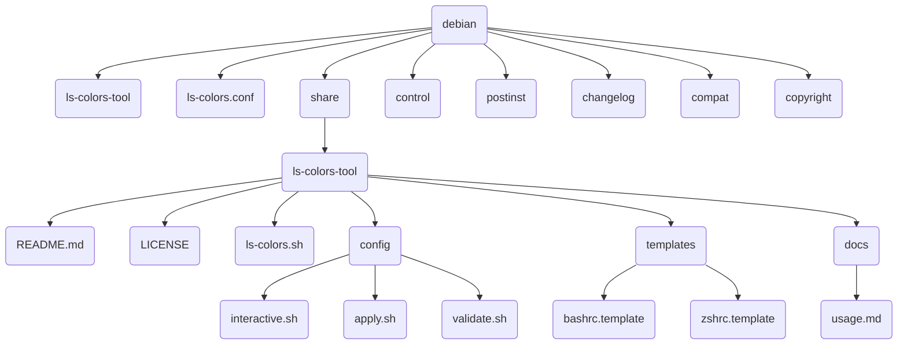

**Colour Bash-Kit Full of Fun

```mermaid
graph LR;
    A[Create a Command-Line Tool] --> B[Provide User-Friendly Interface];
    B --> C[Support for Bash and Zsh];
    C --> D[Package Management];
    D --> E[Documentation];
```

```mermaid
graph TD;
    A(bin) --> B(ls-colors-tool);
    A(etc) --> C(ls-colors.conf);
    A(usr) --> D(share);
    D --> E(ls-colors-tool);
    E --> F(README.md);
    E --> G(LICENSE);
    E --> H(ls-colors.sh);
    E --> I(config);
    I --> J(interactive.sh);
    I --> K(apply.sh);
    I --> L(validate.sh);
    E --> M(templates);
    M --> N(bashrc.template);
    M --> O(zshrc.template);
    E --> P(docs);
    P --> Q(usage.md);
    A(debian) --> R(control);
    A(debian) --> S(postinst);
    A(debian) --> T(changelog);
    A(debian) --> U(compat);
    A(debian) --> V(copyright);
```
Thdscsdcsadasd
